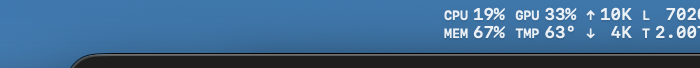
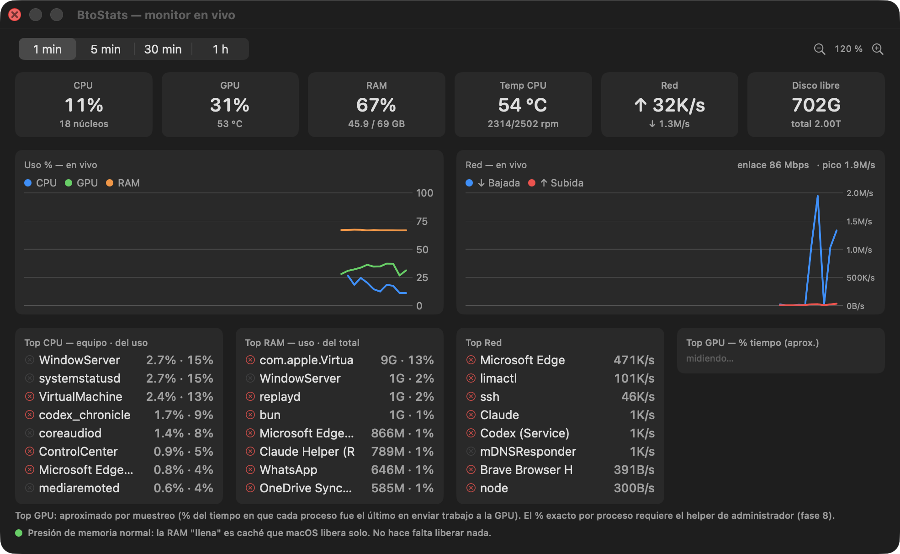
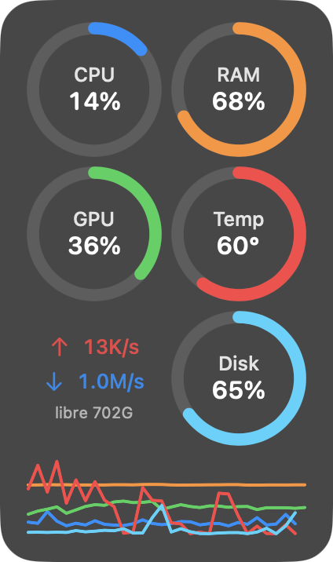
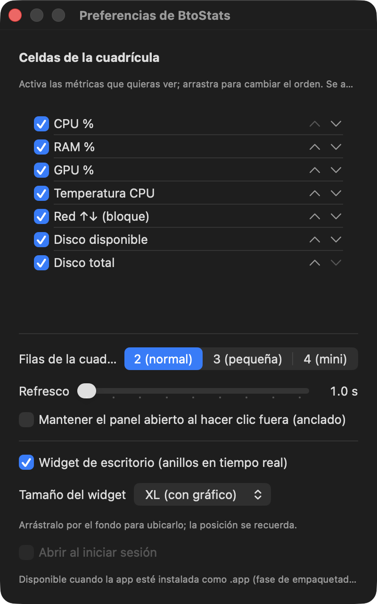

# Manual de BtoStats

Monitor de sistema en tiempo real para la barra de menús de macOS (Apple Silicon).

## Instalación

1. Descarga el zip del [último release](https://github.com/btoaldas/BtoStats/releases).
2. Descomprime y mueve `BtoStats.app` a **Aplicaciones**.
3. Primer arranque: clic derecho sobre la app → **Abrir** (firma ad hoc).
4. **macOS 26**: si el ícono no aparece en la barra, autorízalo en
   *Ajustes del Sistema → Barra de menús*.

## El widget de la barra de menús

Cuadrícula compacta actualizada cada segundo (cadencia configurable). Etiquetas:
`CPU` y `MEM` en %, `GPU` en %, `TMP` temperatura del CPU, `↑ ↓` red
(subida/bajada, siempre juntas), `L` disco libre y `T` disco total.
Las columnas se alinean y ensanchan solas según los valores.

- **1 clic** → abre el panel "monitor en vivo".
- **Clic derecho** → menú con el resumen textual, Preferencias… y Salir.

## El panel (monitor en vivo)

- **Fila superior**: ventana temporal de las gráficas (1 min · 5 min · 30 min · 1 h)
  y zoom −/+ del panel (se recuerda).
- **KPIs**: CPU, GPU (+temperatura), RAM, temperatura (+ventiladores RPM),
  red ↑↓ y disco libre.
- **Gráficas en vivo** con leyenda de colores; la de red muestra el ancho de
  banda del enlace Wi-Fi y el pico de la ventana, con eje en KB/s / MB/s.
  Las gráficas se desplazan (el instante actual siempre está a la derecha).
- **Top procesos**: por CPU (% del equipo · % del uso actual), por RAM
  (uso · % del total), por red (B/s) y GPU aproximado por muestreo.
- **Cerrar procesos**: botón ✕ de cada fila → diálogo con *Terminar*
  (cierre educado), *Forzar cierre* y *Cancelar*. Los procesos de otros
  usuarios aparecen bloqueados (requieren el helper de administrador).
- **Salud de RAM**: semáforo con la presión real de memoria del kernel y un
  consejo honesto — la RAM "llena" es caché que macOS libera solo.

El panel se cierra al hacer clic fuera; en Preferencias puedes anclarlo para
que quede abierto.

## El widget de escritorio

Anillos en tiempo real sobre el fondo de pantalla (debajo de las ventanas).
Se activa en Preferencias, con tamaños **S** (1 métrica), **M** (4), **L** (6)
y **XL** (todo + mini-gráfica de 5 líneas: CPU azul, GPU verde, RAM naranja,
subida roja, bajada celeste). Muestra las métricas que tengas activas, en tu
orden. Arrástralo a donde quieras: la posición se recuerda.

## Preferencias

- **Celdas de la cuadrícula**: check por métrica y orden (arrastre o flechas).
  La red ↑↓ es un bloque indivisible.
- **Filas**: 2 (normal), 3 (pequeña) o 4 (mini).
- **Refresco**: 1 a 5 segundos.
- **Panel anclado**: mantenerlo abierto al hacer clic fuera.
- **Widget de escritorio**: activar y elegir tamaño.
- **Abrir al iniciar sesión**: disponible cuando la app corre instalada como .app.

## Pestaña "Avanzadas"

Todo lo de esta pestaña viene **apagado**: son extras para quien los quiera,
sin afectar el rendimiento de la app base.

En **Preferencias → Avanzadas** activas: colores dinámicos, alertas, umbrales
(CPU y temperatura), mini-gráfica en la barra, histórico persistente y las
funciones de administrador.

En **el panel → Avanzadas** ves: histórico de día/semana/mes, energía en watts
(CPU/GPU/Neural Engine), CPU por clúster, datos del sistema (uptime, carga,
procesos), batería (salud, ciclos), Wi-Fi detallado, disco I/O, Bluetooth y
detalle de memoria (swap y comprimida).

## Preguntas frecuentes

**¿Por qué no pide contraseña ni permisos?** Todo se lee con APIs sin
privilegios (detalle técnico en [VIABILIDAD.md](VIABILIDAD.md)).

**¿Por qué el top de GPU es "aproximado"?** macOS no expone %GPU por proceso
sin permisos de administrador; se muestrea el último proceso que envió trabajo
a la GPU. El % exacto llegará con el helper opcional (fase 8).

**¿"Liberar RAM"?** Los liberadores clásicos son teatro: purgan caché que
macOS repone enseguida. BtoStats muestra la presión real y te deja cerrar a
los verdaderos glotones.

**El ícono no aparece (macOS 26).** Ajustes del Sistema → Barra de menús →
permitir BtoStats.

**¿Por qué no veo frecuencias en GHz ni salud del SSD?** Se descartaron a
propósito: las fuentes disponibles no son fiables en Apple Silicon y preferimos
no mostrar datos que podrían estar mal.

**Las alertas aparecen como ventana, no como notificación.** macOS restringe
las notificaciones de apps con firma ad hoc; en ese caso BtoStats muestra un
aviso propio para que no pierdas la alerta.
